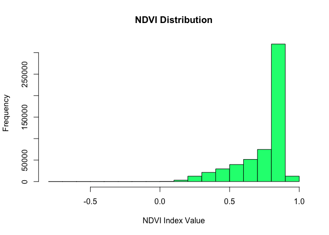

# [VM0047](https://verra.org/wp-content/uploads/2023/09/VM0047_ARR_v1.0-1.pdf): Eligibility, Hazards & Land Degradation Assessment
#### author: "Murphy, S."
#### date: "2024-10-17"


# Objective

VM0047 is Verra's latest methodology for Afforestation, Reforestation, and Revegetation (ARR) projects. The methodology incorporates dynamic performance benchmarks to assess project additionality, emphasizing the use of remote sensing technologies, such as satellite imagery and geospatial data, to monitor project activities, changes in land use and verify carbon sequestration.

Under VM0047's **census-based approach,** project activity must "occur within an area classified as non-forest for the past ten years with less than 10% percent pre-existing woody biomass cover,and/or occur in an area subject to continuous cropping, in ‘settlements”, or “other lands’” (p. 9). The area-based approach has a straightforward applicability checklist, which requires only a 10-year historical land cover assessment for baseline calculations, not required for the initial applicability conditions.

The following workflow assesses area eligibility and historical deforestation risks of a project site in the Binukid province of southern Philippines.\

# Project AOI


``` r
tmap::tmap_mode("view")
tmap::tmap_options(check.and.fix = T)
aoi = read_sf("./test-polygon/test polygon.shp") 
tm_shape(aoi) + 
  tm_borders(col = "red") +
  tm_basemap("Esri.WorldImagery")
```

preserveadc6cf61b2a18336

# Sentinel time series, 2014-2024

A time series cube was derived from the AWS open-source STAC-formatted raster collection of Sentinel-2 level-2 processed analysis-ready-data. The data cube was assembled, processed, and normalized using cloud-computing to save memory. Cloud removal was conducted according to cloudless pixel ranking and monthly median values.


``` r
# Assemble cube from ARD-STAC collection of Sentinel2LA 
cube_202407 <- sits_cube(
  source = "AWS",
  collection = "SENTINEL-2-L2A",
  bands = c("B02", "B03", "B04", "B8A", "B08", "B11", "B12", "CLOUD"),
  start_date = "2024-04-01",
  end_date = "2024-05-01",
  roi = aoi
)

# Normalize by cloudless pixel ranking & monthly medians
cube_202407_reg <- sits_regularize(
  cube       = cube_202407,
  output_dir = './cubes/2024_reg',
  res        = 20,
  period     = "P1M",
  multicores = 8,
)

# Derive NDVI
cube_202407_spectral <- sits::sits_apply(
  data = cube_202407_reg,
  NDVI = (B8A - B04) / (B8A + B04), 
  output_dir = './cubes/2024_reg',
  memsize = 6,
  multicores = 4,
  progress = T
  )
#Derive NDBR
cube_202407_spectral = sits_apply(
  data = cube_202407_spectral, 
  NDBR = (B08 - B12) / (B08 + B12), 
  output_dir = './cubes/2024_reg',
  memsize = 6,
  multicores = 4,
  progress = T
  )
#Derive NDMI
cube_202407_spectral = sits_apply(
  data = cube_202407_spectral, 
  NDMI = (B08 - B11) / (B08 + B11), 
  output_dir = './cubes/2024_reg',
  memsize = 6,
  multicores = 4,
  progress = T
  )

ndvi = list.files("./cubes/2024_reg", 
  pattern = 'NDVI', full.names = T, all.files = FALSE)|>
  lapply(terra::rast)|>
  sprc() |>
  mosaic()
terra::mask(ndvi, vect(aoi))
aoi = sf::st_transform(aoi, crs(ndvi))
ndvi = terra::crop(ndvi, vect(aoi), mask=T)
ndvi = ndvi * 0.0001

writeRaster(ndvi, "./cubes/2024_mosaic/NDVI_2024_07.tif", overwrite=T)
```


# Vegetation signatures

The Normalized Difference Vegetation Index (NDVI) was used to distinguish green vegetation from bare soils and other landscape features. In general, NDVI values range from -1.0 to 1.0, with negative values indicating clouds and water, positive values near zero indicating bare soil, and higher positive values of NDVI ranging from sparse vegetation (0.1 - 0.5) to dense green vegetation (0.6 and above). For instance, in the histogram below, we find NDVI values strongly skewed to the right, towards high NDVI values, indicating a highly vegetated area.

In the following section, we calibrate these NDVI thresholds by comparing outputs with unsupervised classification techniques and the European Space Agency's Global land cover dataset.


``` r
ndvi = rast("./cubes/2024_mosaic/NDVI_2024_07.tif")
hist(ndvi,
  main = "NDVI Distribution",
  col = "springgreen",
  xlab = "NDVI Index Value")
```

<!-- -->

``` r
ndvi_thresholds <- classify(
  ndvi, c(-1.0, 0.1, 0.4, 0.7, 1), 
  include.lowest=TRUE, 
  brackets=TRUE)

tm_shape(ndvi) + 
  tm_raster(title = "NDVI, 2024") +
  tm_shape(aoi) + 
  tm_borders(col = "red") +
  tm_basemap("Esri.WorldImagery") -> map1

tm_shape(ndvi_thresholds) + 
  tm_raster(
    title = "NDVI Thresholds, 2024",
    style = "cat",
    labels = c("Rock/Water (-1.0 to 0.1)", "Bare Earth (0.1 to 0.4)",
               "Shrub/Grassland (0.4 to 0.7)", "Forest (0.5 to 1.0)")) +
  tm_shape(aoi) + 
  tm_borders(col = "red") +
  tm_basemap("Esri.WorldImagery") -> map2

tmap::tmap_arrange(map1, map2, ncol=2)
```

preserve549ea4e3b80d439c

``` r
writeRaster(ndvi_thresholds, "./cubes/2024_mosaic/NDVI_thresholds.tif", overwrite=T)
```

# Unsupervised classification

We apply the K-means clustering method to group pixels into k clusters. The algorithm effectively segments different vegetation types or land cover classes by identifying clusters of similar pixel values. This helps in delineating areas of interest, such as forests, grasslands, and agricultural lands. It is commonly used in the initial data preparation stages prior to supervised classification.

In the following diagrams, we find that the kmeans method corresponded closely with our lower-value NDVI thresholds. However, the kmeans output also suggests that better delineation is needed of further NDVI thresholds within our forest class, such as closed/dense forest and open/sparse forest.


``` r
set.seed(99)
ndvi = raster::raster(ndvi)
nr = raster::getValues(ndvi)
i <- !is.na(nr)

kmncluster <- kmeans(
  nr[i], 
  centers = 10, 
  iter.max = 500, 
  nstart = 5, 
  algorithm="Lloyd")

nr[i] <- kmncluster$cluster
kmeans <- setValues(ndvi, nr)
writeRaster(kmeans, "./cubes/2024_mosaic/NDVI_kmeans.tif", overwrite=T)
```

preserve91d7e51e38aaffff

# Global land cover datasets

In the following, we compare our initial results with the European Space Agency's CCI Global Land Cover [Dataset](https://land.copernicus.eu/en/products/global-dynamic-land-cover). Cross-checking results against additional datasets is recommended: MODIS, GlobCover, Hansen Forest Change.

Results suggest that the project area does not meet VM0047 criteria to make it eligible for the census-based approach.


``` r
tmap::tmap_mode("view")
esa_soil = raster("~/Repos/lulc-risk-check-VM0047/inputs/esa_land_cover.tiff")
tm_shape(esa_soil) +
  tm_raster(style= "cat", palette = 'viridis',
            title="ESA Land Cover, 2019",
            labels = c("NA", 
                       "Shrubs",
                       "Herbaceous vegetation", 
                       "Cropland",
                       "Urban",
                       "Herbaceous wetland",
                       "Closed forest, mixed",
                       "Closed forest, unknown",
                       "Open forest, mixed",
                       "Open forest, unknown")) +
  tm_shape(aoi) + 
  tm_borders(col = "red") +
  tm_basemap("Esri.WorldImagery")-> map1

tm_shape(ndvi_thresholds) + 
  tm_raster(
    title = "NDVI Thresholds, 2024",
    style = "cat",
    labels = c("Rock/Water (-1.0 to 0.1)", "Bare Earth (0.1 to 0.4)",
               "Shrub/Grassland (0.4 to 0.7)", "Forest (0.7 to 1.0)")) +
  tm_shape(aoi) + 
  tm_borders(col = "red") +
  tm_basemap("Esri.WorldImagery") -> map2

tmap::tmap_arrange(map1, map2, ncol = 2)
```

preservee49f9ad1de8af612

# Land degradation

Detecting and monitoring degraded land is essential to VM0047 project activity and reporting. This is required to demonstrate that projects provide additional carbon sequestration benefits compared to the pre-project and ongoing project conditions. Understanding the degree of land degradation helps validate the effectiveness of restoration efforts.

According to SDG 15.3.1, land degradation is defined as the proportion of land degraded over total land area. In order to assess land degradation, the SDG Indicator 15.3.1 measures 3 sub-indicators:

-   Vegetation productivity
-   Land cover
-   Soil organic carbon

## Land productivity sub-indicator

Land productivity refers to the biological capacity of land to produce food, fiber, and fuel essential for human sustenance (United Nations Statistical Commission, 2016). Net primary productivity (NPP) measures the net carbon assimilated through photosynthesis minus autotrophic respiration during a specific time frame (Clark et al., 2001; kg/ha/yr). A widely used proxy for Net Primary Productivity (NPP) is the Normalized Difference Vegetation Index (NDVI). We applied the `trends.earth` algorithm to assess bi-weekly datasets from MODIS and AVHRR to calculate yearly NDVI averages. In effect, we determined trends in land productivity, primary productive class, and site's performance in terms of regional NDVI change.

## Land cover sub-indicator

To assess changes in land cover, annual land cover maps drawn from the ESA CCI land cover collection are reclassified to the 7 land cover classes used in the UNCCD reporting framework (forest, grassland, cropland, wetland, artificial area, bare land and water). Reclassified maps inform a land transition analysis to identify which pixels remained in the same land cover class, and which ones changed. Applying the `trends.earth` algorithm, the following table of degradation typologies by land cover transition was used to compute the land cover sub-indicator.


## Soil organic carbon sub-indicator

The third sub-indicator for monitoring land degradation as part of the SDG process quantifies changes in soil organic carbon (SOC) over the reporting period. Reference values were derived from the SoilGrids 250m carbon stocks dataset, filtered to the first 30 cm profile. Land use conversion coefficients were applied using the `trends.earth` algorithm. Using land cover as a proxy for land use, changes in carbon stocks were computed proportionally after 20 years of land cover change. Aareas which experienced a loss in SOC of 10% of more during the reporting period will be considered potentially degraded, and areas experiencing a gain of 10% or more as potentially improved.


``` r
productivity = raster("./inputs/degradation/prod_degradation.tif")
soil_carbon = raster("./inputs/degradation/soil_degradation.tif")
land_cover = raster("./inputs/degradation/cover_degradation.tif")
land_degradation = raster("./inputs/degradation/land_degradation.tif")

tm_shape(productivity) + 
  tm_raster(
    title = "Land Productivity Change, 2012-2022",
    style = "cat",
    labels = c("Improvement",
               "Degradation",
               "Stable")) +
  tm_shape(aoi) + 
  tm_borders(col = "red") +
  tm_basemap("Esri.WorldImagery") -> map1

tm_shape(soil_carbon) + 
  tm_raster(
    title = "Soil Carbon Change, 2012-2022",
    style = "cat",
    labels = c("Improvement",
               "Degradation",
               "Stable")) +
  tm_shape(aoi) + 
  tm_borders(col = "red") +
  tm_basemap("Esri.WorldImagery") -> map2

tm_shape(land_cover) + 
  tm_raster(
    title = "Land Cover Change, 2012-2022",
    style = "cat",
    labels = c("Improvement",
               "Degradation",
               "Stable")) +
  tm_shape(aoi) + 
  tm_borders(col = "red") +
  tm_basemap("Esri.WorldImagery") -> map3

tm_shape(land_degradation) + 
  tm_raster(
    title = "Land Degradation, 2012-2022",
    style = "cat",
    labels = c("Stable",
               "Improvement")) +
  tm_shape(aoi) + 
  tm_borders(col = "red") +
  tm_basemap("Esri.WorldImagery") -> map4

tmap::tmap_arrange(map1, map2, map3, map4, ncol = 2, nrow = 2)
```

preserveaf9345a2133c1ae7

# Mapping Forest Loss


``` r
ndvi_2024 = rast("./cubes/2024_mosaic/NDVI_2024_07.tif")
ndvi_2014 = rast("./cubes/2014_mosaic/NDVI_2014.tif")

ndvi_2014_clamp = clamp(
  ndvi_2014, 0.7, 1.0, values=F, overwrite=T,
  filename="./cubes/2014_mosaic/NDVI_2014_clamped.tif")
  
ndvi_2024_clamp = clamp(
  ndvi_2024, 0.86, 1.0, values=F, overwrite=T,
  filename="./cubes/2024_mosaic/NDVI_2024_clamped.tif")

ndvi_change = ndvi_2014_clamp - ndvi_2024_clamp 
ndvi_loss = clamp(
  ndvi_change, 0.0, 1.0, values=F, overwrite=T,
  filename="./cubes/2024_mosaic/NDVI_loss.tif")
ndvi_loss = classify(ndvi_loss, c(0.01, 0.25))

tm_shape(ndvi_loss) + 
  tm_raster(style = "cat", palette = "red",
    title = "NDVI Loss, 2014 - 2024",
    legend.show = F) +
  tm_shape(aoi) + 
  tm_borders(col = "red") +
  tm_basemap("Esri.WorldImagery")
```

preservec0221dab0ca722c1


``` python
import datetime as dt
import os
import tempfile
from pathlib import Path

import numpy as np
from osgeo import gdal, osr
from te_algorithms.gdal.util import trans_factors_for_custom_legend
from te_schemas.land_cover import LCLegendNesting
from te_schemas.results import URI, DataType, Raster, RasterFileType, RasterResults
from te_schemas.results import Band as JobBand

import LDMP.logger

from .. import utils, worker
from ..areaofinterest import AOI
from ..jobs.models import Job


def compute_soil_organic_carbon(
    soc_job: Job,
    area_of_interest: AOI,
    job_output_path: Path,
    dataset_output_path: Path,
) -> Job:
    # Select the initial and final bands from initial and final datasets
    # (in case there is more than one lc band per dataset)
    lc_initial_vrt = utils.save_vrt(
        soc_job.params["lc_initial_path"], soc_job.params["lc_initial_band_index"]
    )
    lc_final_vrt = utils.save_vrt(
        soc_job.params["lc_final_path"], soc_job.params["lc_final_band_index"]
    )
    lc_files = [lc_initial_vrt, lc_final_vrt]
    lc_vrts = []

    for index, path in enumerate(lc_files):
        vrt_path = tempfile.NamedTemporaryFile(suffix=".vrt").name
        # Add once since band numbers don't start at zero
        gdal.BuildVRT(
            vrt_path,
            lc_files[index],
            bandList=[index + 1],
            outputBounds=area_of_interest.get_aligned_output_bounds_deprecated(
                lc_initial_vrt
            ),
            resolution="highest",
            resampleAlg=gdal.GRA_NearestNeighbour,
            separate=True,
        )
        lc_vrts.append(vrt_path)
    custom_soc_vrt = utils.save_vrt(
        soc_job.params["custom_soc_path"], soc_job.params["custom_soc_band_index"]
    )
    climate_zones_path = Path(__file__).parents[1] / "data" / "IPCC_Climate_Zones.tif"
    in_files = [
        custom_soc_vrt,
        str(climate_zones_path),
    ] + lc_vrts

    nesting = LCLegendNesting.Schema().load(
        soc_job.params["legend_nesting_custom_to_ipcc"]
    )

    in_vrt_path = tempfile.NamedTemporaryFile(suffix=".vrt").name
    LDMP.logger.log("Saving SOC input files to {}".format(in_vrt_path))
    gdal.BuildVRT(
        in_vrt_path,
        in_files,
        resolution="highest",
        resampleAlg=gdal.GRA_NearestNeighbour,
        outputBounds=area_of_interest.get_aligned_output_bounds_deprecated(
            lc_initial_vrt
        ),
        separate=True,
    )
    LDMP.logger.log(f"Saving soil organic carbon to {dataset_output_path!r}")
    # Lc bands start on band 3 as band 1 is initial soc, and band 2 is
    # climate zones
    lc_band_nums = list(range(3, len(lc_files) + 3))
    soc_worker = worker.StartWorker(
        SOCWorker,
        "calculating change in soil organic carbon",
        in_vrt_path,
        str(dataset_output_path),
        lc_band_nums,
        soc_job.params["lc_years"],
        soc_job.params["fl"],
        nesting,
    )

    if soc_worker.success:
        soc_job.end_date = dt.datetime.now(dt.timezone.utc)
        soc_job.progress = 100
        bands = [
            JobBand(
                name="Soil organic carbon (degradation)",
                metadata={
                    "year_initial": soc_job.params["lc_years"][0],
                    "year_final": soc_job.params["lc_years"][-1],
                },
            )
        ]

        for year in soc_job.params["lc_years"]:
            soc_band = JobBand(name="Soil organic carbon", metadata={"year": year})
            bands.append(soc_band)

        for year in soc_job.params["lc_years"]:
            lc_band = JobBand(
                name="Land cover",
                metadata={
                    "year": year,
                    "nesting": LCLegendNesting.Schema().dumps(nesting),
                },
            )
            bands.append(lc_band)

        soc_job.results = RasterResults(
            name="soil_organic_carbon",
            uri=URI(uri=dataset_output_path),
            rasters={
                DataType.INT16.value: Raster(
                    uri=URI(uri=dataset_output_path),
                    bands=bands,
                    datatype=DataType.INT16,
                    filetype=RasterFileType.GEOTIFF,
                ),
            },
        )
    else:
        raise RuntimeError("Error calculating soil organic carbon")

    return soc_job
```
